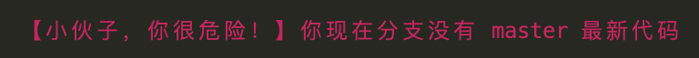

# check-has-master-last

本 cli 是根据 git 的 tag 检测当前分支是否有 master 分支最新代码。

你会问这个具体有什么用，那看看下面问题事故场景：

>  某产品🐶，提了个需求，要求开发同时要做 feature1 和 feature2，其中 feature1 先提前好几天发布，在当发布 feature2当天，**你发现没 feature2 没有 feature1 的代码**，然后心里各种羊驼 🦙。


### 1、安装和配置

要配合 githooks 一起使用，这里以 husky 为例

```bash
npm i -D check-has-master-last husky
```

```json
{
  "husky": {
    "hooks": {
      "pre-push": "./node_modules/.bin/chml",
      "...": "..."
    }
  }
}
```

### 2、使用

当 git push 时，提示下面错误。你跟我，赶紧打 tag。


当 git push 时，提示下面错误。你跟我，赶紧拉去 master 最新代码。



注意：这里 master 默认是生产代码分支，也默认在此分支打tag。
